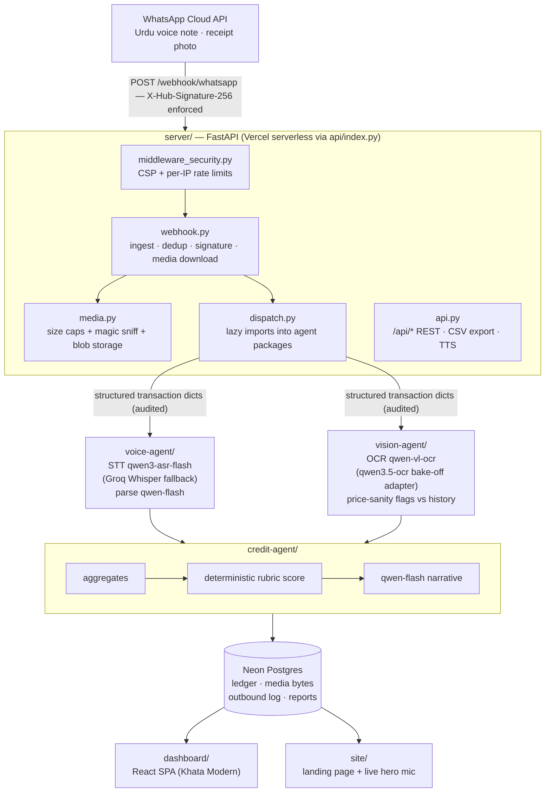

# Bizro

Bizro is a zero-typing WhatsApp bookkeeping copilot for Pakistani karyana
(corner) shopkeepers. A shopkeeper sends an Urdu voice note ("sold ghee to
Rahmat for 3000 cash") or a receipt photo on WhatsApp; the pipeline parses it
into a structured ledger entry with a full audit trail (the original
audio/photo bytes are stored), and the accumulated history produces a
lender-legible Credit Readiness report for Alkhidmat Mawakhat loan officers.

No app to install, nothing to type. The khata becomes a memory, and the memory
becomes credit.

Built for the Bano Qabil x Alibaba Cloud AI Hackathon Pakistan 2026.

## The product in seconds

<p align="center">
  <video src="assets/bizro-ad.mp4" controls muted playsinline width="720"></video>
</p>

A 43-second ad for the zero-typing loop: an Urdu voice note or receipt photo
in on WhatsApp, a structured ledger entry and a credit-ready history out.

## Live

- Production: <https://bizro-pk.vercel.app> — `/`, `/ledger` and `/health` all
  returned HTTP 200 on 2026-09-07
- Aliases: `getbizro.vercel.app`, `bizro-app.vercel.app`, `bizro-ai.vercel.app`
- `/` is the marketing site. The dashboard SPA lives at `/ledger`, `/credit`,
  `/simulator`, and `/settings`; any other path gets an honest not-found screen.
- Live status (`GET /health`): DashScope live on the international Model Studio
  endpoint, WhatsApp live with webhook signature validation enforced, all four
  agent pipelines imported.

## Architecture

One repo, one origin. A FastAPI app serves the WhatsApp webhook, the REST API,
and the built frontend assets; the model work lives in three agent packages
the server calls into.



All model calls run on Alibaba Cloud Model Studio (DashScope
OpenAI-compatible mode). See `docs/Bizro_Guide.pdf` for the full pipeline walkthrough,
the model stack and its fallbacks, and the security posture.

## Repo layout

- `server/` — FastAPI app: webhook, REST API, media audit trail, security
  middleware (`server/app/`). Vercel entry: `api/index.py`.
- `dashboard/` — React + Vite + Tailwind control room ("Khata Modern"):
  ledger, credit, simulator, settings screens.
- `site/` — the marketing landing page, including a hero demo card that
  records real browser audio and posts it to the live webhook.
- `voice-agent/` — voice pipeline: STT plus transaction parsing.
- `vision-agent/` — receipt OCR pipeline with price-sanity flags.
- `credit-agent/` — Credit Readiness report: aggregates, rubric, narrative.
- `qa/` — read-only QA suite: contract tests against the shared schema and
  dashboard contract tests.
- `docs/` — the shipped documentation: `Bizro_Guide.pdf` (deep guide) and
  `Bizro_Pitch.pptx` (pitch deck).
- `scripts/` — `deploy.sh` (prod deploy) and `run_demo.sh` (one-command local
  demo).
- `.agents/` — the multi-agent build system used during the hackathon
  (orchestrator dispatches worker skills). Local-only and gitignored: the
  shipped repo is the product, not the scaffolding.

## Quickstart

Prerequisites: Python 3.12+, Node 18+ (for the frontends), a terminal (Git
Bash on Windows works; commands below are run from the repo root).

One command (creates a venv, installs, builds the UIs, seeds demo data,
serves everything on `http://localhost:8000`):

```bash
bash scripts/run_demo.sh
```

Or step by step:

```bash
# 1. Python environment + dependencies
python -m venv .venv
source .venv/Scripts/activate    # Git Bash on Windows (bin/activate elsewhere)
python -m pip install -r requirements.txt

# 2. Environment: copy the contract and fill in what you have
cp .env.example .env
# Zero keys is a valid state: MOCK_MODE=auto serves clearly-labeled mock
# output everywhere, and the offline test suites need no credentials.

# 3. Seed demo data (only if the DB is empty), then run the server
python credit-agent/scripts/seed_demo.py
python -m uvicorn server.app.main:app --reload --port 8000

# 4. Frontends (second terminal each)
cd dashboard && npm install && npm run dev   # http://localhost:5173, proxies /api and /webhook to :8000
cd site && npm install && npm run dev        # landing page dev server
```

With the server alone (no Node), the built `site/dist` and `dashboard/dist`
are served at `/` and `/ledger` directly — that is exactly what production
does.

## Tests

All three suites are offline and deterministic; no credentials needed.

```bash
cd server && python -m pytest tests -q        # 129 passed (measured 2026-09-04)
cd site && npx vitest run                     # 30 passed, 4 files
python -m pytest qa/tests voice-agent/tests vision-agent/tests credit-agent/tests -q   # 191 passed, 3 xfailed, 13 xpassed
```

350 tests green in total. Type checks: `npx tsc --noEmit` in `dashboard/` and
`site/` (also enforced by `npm run build`).

## Deploy

```bash
npx vercel login        # once
bash scripts/deploy.sh
```

The script builds `dashboard/` and `site/`, runs `vercel deploy --prod`,
re-points the four aliases, and verifies `/health` and `/` return 200. Vercel
env vars (see the table below) are managed in the Vercel dashboard. Production
runs on Neon Postgres with `MEDIA_DIR=/tmp/media` — see `docs/Bizro_Guide.pdf`
for what is durable where.

## Environment variables

Canonical contract: `.env.example` (copy to `.env`). Never commit `.env`.

| Variable | Purpose | Default |
| --- | --- | --- |
| `DASHSCOPE_API_KEY` | Alibaba Model Studio key; empty switches all model output to clearly-labeled mock | — |
| `DASHSCOPE_BASE_URL` | OpenAI-compatible endpoint (international accounts: `https://dashscope-intl.aliyuncs.com/compatible-mode/v1`) | China-mainland URL |
| `MODEL_VOICE` | Voice/text transaction parsing model | `qwen-flash` |
| `MODEL_OCR_VL` | Primary receipt OCR model | `qwen-vl-ocr` |
| `MODEL_OCR_NEW` | Bake-off OCR adapter model | `qwen3.5-ocr` |
| `MODEL_REASONING` | Credit narrative + reminder drafts | `qwen-flash` |
| `OCR_MODEL` | Which OCR adapter runs: `vl` or `new` | `vl` |
| `STT_PROVIDER` | `qwen` (qwen3-asr-flash primary) or `groq` | `groq` |
| `STT_QWEN_MODEL` | Qwen ASR model id | `qwen3-asr-flash` |
| `STT_API_KEY` / `STT_BASE_URL` / `STT_MODEL` / `STT_LANGUAGE` | Groq Whisper fallback (free tier) | Groq URL, `whisper-large-v3-turbo`, `ur` |
| `WHATSAPP_TOKEN` / `WHATSAPP_PHONE_NUMBER_ID` | WhatsApp Cloud API credentials (System User token) | — |
| `WHATSAPP_VERIFY_TOKEN` | Webhook verification handshake | `bizro-verify` |
| `WHATSAPP_APP_SECRET` | Enables `X-Hub-Signature-256` enforcement; empty = disabled | — |
| `DATABASE_URL` | SQLite locally; Neon Postgres in production | `sqlite:///./bizro.db` |
| `MEDIA_DIR` | Media tree root (`/tmp/media` on Vercel) | `./media` |
| `MOCK_MODE` | `auto` (real when keys exist), `always`, `never` | `auto` |
| `CONFIDENCE_CONFIRM_THRESHOLD` | Parse confidence below this keeps entries pending | `0.75` |
| `NUMERAL_STYLE` | `western` or `urdu` digits in surfaces | `western` |
| `PORT` | Server port | `8000` |
| `RATE_LIMIT_WEBHOOK_PER_HOUR` | Per-IP hourly budget for `POST /webhook/whatsapp` | `30` |
| `RATE_LIMIT_GENERAL_PER_MIN` | Per-IP per-minute budget for everything else | `120` |
| `OPENROUTER_DAILY_BUDGET` | Hard stop for `llm_guard.py` when the endpoint points at OpenRouter | `40` |

Defaults above are the code defaults (`server/app/config.py`,
`voice-agent/voice_agent/config.py`, `vision-agent/vision_agent/config.py`);
`.env.example` mirrors them, including the `qwen3-asr-flash` STT block and a
commented OpenRouter free-tier fallback (OpenAI-compatible swap for the
`DASHSCOPE_*` names, budget-capped by `llm_guard.py`).

## Documentation

Both deliverables live in `docs/`:

- `docs/Bizro_Guide.pdf` — the deep guide as a print-ready PDF: local setup,
  the webhook flow, the Qwen model stack and fallbacks, the demo walkthrough,
  security posture, ops, and troubleshooting.
- `docs/Bizro_Pitch.pptx` — the 11-slide pitch deck (problem, the Mawakhat
  lending rail, solution, live demo, how it works, technology, trust & audit,
  why Bizro, impact).
